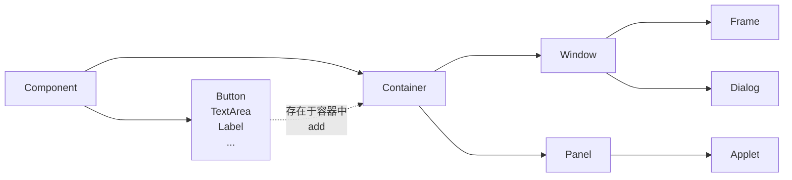

[参考链接1]: https://www.bilibili.com/video/BV1DJ411B75F/?spm_id_from=333.788.videopod.episodes&amp;vd_source=84070ec9f13d00198e3cfdd2cbad0c23&amp;p=3

[参考链接2]: https://mermaid.js.org/syntax/flowchart.html

# AWT

### 1.概述



### 2.组件与容器

#### Frame

```java
// 展示一个窗口
import java.awt.*;

public class TestFrame {
    public static void main(String[] args) {
        Frame frame = new Frame();
        frame.setBackground(Color.black);
        frame.setSize(200, 200);
        frame.setTitle("my first frame");
        frame.setLocation(100, 100);
        frame.setVisible(true);
    }
}
```

```java
// 展示多个窗口
import java.awt.*;

public class TestFrame2 {
    public static void main(String[] args) {
        MyFrame myFrame1 = new MyFrame(100, 100, 100, 100, Color.black);
        MyFrame myFrame2 = new MyFrame(200, 100, 100, 100, Color.green);
        MyFrame myFrame3 = new MyFrame(100, 200, 100, 100, Color.gray);
        MyFrame myFrame4 = new MyFrame(200, 200, 100, 100, Color.red);
    }
}

class MyFrame extends Frame{
    static int i = 0;
    MyFrame(int x, int y, int w, int h, Color color){
        super("my frame "+ (++i));
        setBackground(color);
        setSize(w, h);
        setLocation(x, y);
        setVisible(true);
    }
}
```

#### Panel

```java
// 画一个panel
import java.awt.*;
import java.awt.event.WindowAdapter;
import java.awt.event.WindowEvent;

public class TestPanel {
    public static void main(String[] args) {
        Frame frame = new Frame();
        frame.setLayout(null);
        frame.setBounds(200, 200, 500, 500);
        frame.setBackground(new Color(0xB4B44A));
        Panel panel = new Panel();
        panel.setBackground(new Color(0x80B754));
        panel.setBounds(100, 100, 300, 300);
        frame.add(panel);
        frame.setVisible(true);
        frame.addWindowListener(new WindowAdapter() {
            @Override
            public void windowClosing(WindowEvent e) {
                System.exit(0);
            }
        });
    }
}
```

### 3.布局管理

#### 流式布局

```java
import java.awt.*;

public class TestFlowLayout {
    public static void main(String[] args) {
        Frame frame = new Frame("TestFlowLayout");

        Button button1 = new Button("button1");
        Button button2 = new Button("button2");
        Button button3 = new Button("button3");

//        frame.setLayout(new FlowLayout());
//        frame.setLayout(new FlowLayout(FlowLayout.LEFT));
        frame.setLayout(new FlowLayout(FlowLayout.RIGHT));
        frame.setSize(500, 500);
        frame.add(button1);
        frame.add(button2);
        frame.add(button3);
        frame.setVisible(true);
    }
}
```

#### 东西南北中

```java
import java.awt.*;

public class TestBorderLayout {
    public static void main(String[] args) {
        Frame frame = new Frame();

        Button east = new Button("East");
        Button west = new Button("West");
        Button north = new Button("North");
        Button south= new Button("South");
        Button center = new Button("Center");

        frame.add(east, BorderLayout.EAST);
        frame.add(west, BorderLayout.WEST);
        frame.add(north, BorderLayout.NORTH);
        frame.add(south, BorderLayout.SOUTH);
        frame.add(center, BorderLayout.CENTER);

        frame.setBounds(500, 500, 200, 200);
        frame.setVisible(true);
    }
}
```

#### 表格布局

```java
import java.awt.*;

public class TestGridLayout {
    public static void main(String[] args) {
        Frame frame = new Frame();

        Button btn1 = new Button("btn1");
        Button btn2 = new Button("btn2");
        Button btn3 = new Button("btn3");
        Button btn4 = new Button("btn4");
        Button btn5 = new Button("btn5");
        Button btn6 = new Button("btn6");

        frame.setLayout(new GridLayout(3, 2));

        frame.add(btn1);
        frame.add(btn2);
        frame.add(btn3);
        frame.add(btn4);
        frame.add(btn5);
        frame.add(btn6);

        frame.pack();
        frame.setVisible(true);
    }
}
```

#### 综合应用


```java
import java.awt.*;
import java.awt.event.WindowAdapter;
import java.awt.event.WindowEvent;

public class TestExercise {
    public static void main(String[] args) {
        Frame frame = new Frame();
        frame.setSize(400, 300);
        frame.setLocation(300, 400);
        frame.setBackground(Color.black);
        frame.setVisible(true);
        frame.setLayout(new GridLayout(2, 1));

        Panel p1 = new Panel(new BorderLayout());
        Panel p2 = new Panel(new GridLayout(2, 1));
        Panel p3 = new Panel(new BorderLayout());
        Panel p4 = new Panel(new GridLayout(2,2));

        // Top
        p1.add(new Button("East-1"), BorderLayout.EAST);
        p2.add(new Button("p2-btn1"));
        p2.add(new Button("p2-btn2"));
        p1.add(p2, BorderLayout.CENTER);
        p1.add(new Button("West-1"), BorderLayout.WEST);

        //Bottom
        p3.add(new Button("East-2"), BorderLayout.EAST);
        for(int i=1; i <= 4; i++){
            p4.add(new Button("p4-btn"+i));
        }
        p3.add(p4, BorderLayout.CENTER);
        p3.add(new Button("West-2"), BorderLayout.WEST);

        frame.add(p1);
        frame.add(p3);

        frame.addWindowListener(new WindowAdapter() {
            @Override
            public void windowClosing(WindowEvent e) {
                System.exit(0);
            }
        });
    }
}
```

总结：

1.Frame是一个顶级窗口

2.Panel无法单独显示，需要添加到某个容器中

### 4.事件监听

```java
import java.awt.*;
import java.awt.event.ActionEvent;
import java.awt.event.ActionListener;
import java.awt.event.WindowAdapter;
import java.awt.event.WindowEvent;

public class TestActionEvent {
    public static void main(String[] args) {
        Frame frame = new Frame();

        Button button = new Button("submit");
        MyActionListener myActionListener = new MyActionListener();
        button.addActionListener(myActionListener);

        frame.add(button);
        frame.setBounds(100, 100, 100,100);
        windowClose(frame);
        frame.setVisible(true);
    }

    private static void windowClose(Frame frame){
        frame.addWindowListener(new WindowAdapter() {
            @Override
            public void windowClosing(WindowEvent e) {
                System.exit(0);
            }
        });
    }
}


class MyActionListener implements ActionListener {

    @Override
    public void actionPerformed(ActionEvent e) {
        System.out.println("aaaaa");
    }
}
```

```java
import java.awt.*;
import java.awt.event.ActionEvent;
import java.awt.event.ActionListener;

public class TestActionEvent2 {
    public static void main(String[] args) {
        Frame frame = new Frame();
        frame.setBounds(100, 100, 200, 200);
        frame.pack();
        frame.setVisible(true);
        Button button1 = new Button("Start");
        Button button2 = new Button("Stop");
        frame.add(button1, BorderLayout.NORTH);
        frame.add(button2, BorderLayout.SOUTH);
        MyMonitor myMonitor = new MyMonitor();
        button1.addActionListener(myMonitor);
        button2.addActionListener(myMonitor);
    }
}


class MyMonitor implements ActionListener{

    @Override
    public void actionPerformed(ActionEvent e) {
        System.out.println(e.getActionCommand()+"-->clicked");
    }
}
```

### 5.输入框

```java
import java.awt.*;
import java.awt.event.ActionEvent;
import java.awt.event.ActionListener;

public class TestTextField {
    public static void main(String[] args) {
        new MyFrame();
    }
}

class MyFrame extends Frame {
    public MyFrame(){
        TextField textField = new TextField();
        MyActionListener2 myActionListener2 = new MyActionListener2();
        textField.addActionListener(myActionListener2);
        textField.setEchoChar('*');
        setBounds(100, 100, 100,100);
        add(textField);
        pack();
        setVisible(true);
    }
}

class MyActionListener2 implements ActionListener{

    @Override
    public void actionPerformed(ActionEvent e) {
        TextField textField = (TextField) e.getSource();
        System.out.println(textField.getText());
        textField.setText("");
    }
}
```

### 6.简易计算器

```java
import java.awt.*;
import java.awt.event.ActionEvent;
import java.awt.event.ActionListener;

public class TestCalc {
    public static void main(String[] args) {
        MyCalc myCalc = new MyCalc();
        myCalc.LoadFrame();
    }
}


class MyCalc extends Frame{
    TextField num1, num2, num3;

    public void LoadFrame(){
        num1 = new TextField();
        num2 = new TextField();
        num3 = new TextField();
        num1.setColumns(10);
        num2.setColumns(10);
        num3.setColumns(20);
        Label label = new Label("+");
        Button button = new Button("=");

        button.addActionListener(new MyActionListener3(this));

        this.setLayout(new FlowLayout(FlowLayout.CENTER));
        add(num1);
        add(label);
        add(num2);
        add(button);
        add(num3);

        pack();
        setVisible(true);
    }
}

class MyActionListener3 implements ActionListener{

    MyCalc myCalc;

    MyActionListener3(MyCalc myCalc){
        this.myCalc = myCalc;
    }

    @Override
    public void actionPerformed(ActionEvent e) {
        Integer num1 = Integer.parseInt(myCalc.num1.getText());
        Integer num2 = Integer.parseInt(myCalc.num2.getText());

        myCalc.num3.setText(""+(num1+num2));
        myCalc.num1.setText("");
        myCalc.num2.setText("");
    }
}
```

### 7.画笔

```java
import java.awt.*;

public class TestPaint {
    public static void main(String[] args) {
        new MyPaint().LoadFrame();
    }
}


class MyPaint extends Frame {
    @Override
    public void paint(Graphics g) {
        g.setColor(Color.gray);
        g.drawOval(100, 100, 100, 100);
        g.drawRoundRect(100, 200, 100, 100, 1, 1);
    }

    public void LoadFrame(){
        setBounds(100, 100, 500, 400);
        setVisible(true);
    }
}
```

> ##### TIP
>
> **自动触发：** 当你创建一个 `Frame` 并调用 `setVisible(true)` 时，系统会自动请求该窗口的重绘。在重绘过程中，`Frame` 的 `paint` 方法会被调用。此时如果你重写了 `paint` 方法，系统会调用你重写的版本。
{: .block-tip }

### 8.鼠标监听

```java
import java.awt.*;
import java.awt.event.MouseAdapter;
import java.awt.event.MouseEvent;
import java.util.ArrayList;

public class TestMouseListener {
    public static void main(String[] args) {
        new MyMousePaint();
    }
}

class MyMousePaint extends Frame{

    ArrayList<Point> points;

    MyMousePaint(){
        points = new ArrayList<Point>();

        setBounds(100, 100, 400, 400);

        addMouseListener(new MyMouseListener());

        setVisible(true);
    }

    @Override
    public void paint(Graphics g) {
        g.setColor(Color.black);
        for (Point point : points) {
            g.fillOval(point.x, point.y, 10, 10);
        }
        repaint();
    }

    private class MyMouseListener extends MouseAdapter{
        @Override
        public void mousePressed(MouseEvent e) {
            points.add(e.getPoint());
        }
    }
}
```

### 9.窗口监听

```java
import java.awt.*;
import java.awt.event.WindowAdapter;
import java.awt.event.WindowEvent;

public class TestWindowListener {
    public static void main(String[] args) {
        new MyFrame("window listener");
    }
}

class MyFrame extends Frame{
    MyFrame(String title){
        super(title);

        setBounds(100, 100, 200, 200);
        addWindowListener(new WindowAdapter() {
            @Override
            public void windowActivated(WindowEvent e) {
                System.out.println("window activated");
            }

            @Override
            public void windowClosing(WindowEvent e) {
                System.out.println("window closing");
            }
        });
        setVisible(true);
    }
}
```

### 10.键盘监听

```java
import java.awt.*;
import java.awt.event.KeyAdapter;
import java.awt.event.KeyEvent;

public class TestKeyboardListener {
    public static void main(String[] args) {
        new KeyFrame();
    }
}

class KeyFrame extends Frame {
    KeyFrame(){
        setBounds(100, 100, 100,100);
        addKeyListener(new KeyAdapter() {
            @Override
            public void keyPressed(KeyEvent e) {
                System.out.println(e.getKeyCode());
            }
        });
        setVisible(true);
    }
}
```

# Swing
